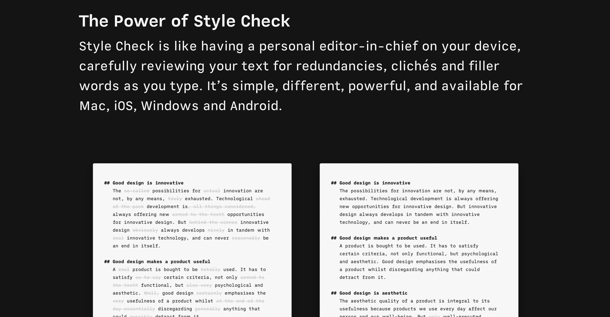
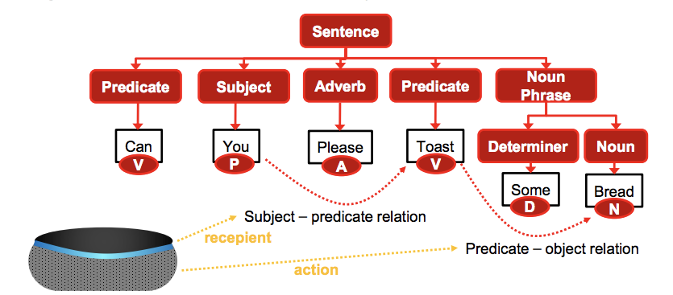
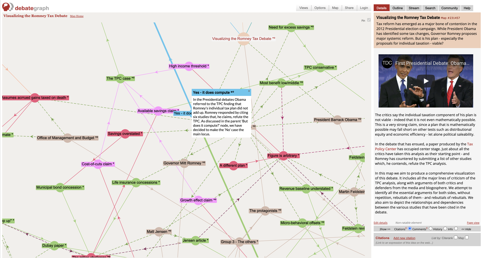

Most of today's communication is unclear, imprecise, and unscientific. While building a remote/async-first startup, difficulties with internal company messaging revealed the importance of clear and precise communication. Consequently, I've studied the root causes of this lack of clarity, exploring ideas from software engineering and masters of the English language. I found that everyone can take a few simple steps to write more clearly, drastically improving their communication efficiency. More specifically, I found conceptual and software tools that can augment the communication process; There are many ways to structure, improve a text which leads to more clarity for the writer and thereby increases the possibility for the reader.

On average, we spend a staggering 50%-80% of our workday communicating. A 2006 study showed that people spent two-thirds of that time talking. The recent pandemic-driven shift to remote work has increased the need for effective cross-time-zone, asynchronous written communication even more.

Poor communication is a massive cost and productivity drain As shown by the statistic that businesses with approximately 100 employees spend on average [17 hours a week](https://www.quantified.ai/blog/how-much-of-our-workdays-do-we-spend-communicating/) clarifying unclear messages. This productivity drain translates to an annual cost of at least $525,000, or $5,250 per employee per year.

Companies like Amazon, which embraced written communication from the beginning, demonstrate its effectiveness and success. [Influenced by Edward Tufte](https://playtopotential.com/audio/761), a famous statistician known for his work on information design, they replaced PowerPoint presentations with written documents because they come with higher information density and enable a detailed shared context. Increasing the shared context reduces the [inferential distances](https://www.lesswrong.com/tag/inferential-distance) or the number of concepts that one needs to understand a given piece of information.

# Mathematics vs. Language

Comparing language, the primary communication tool of our species, to mathematics helps us understand a crucial tradeoff. Math is precise, i.e., requires propositional truth (ex. "This sentence is a lie" is not possible), but requires a high amount of effort to attain this precision.

Language is imprecise but requires low effort. Our brains can make up for the lack of precision in many situations. As receivers, we are fast at correlating and extracting logic from sentences using vast amounts of training data, i.e., the context we have acquired throughout our lives.

To communicate clearly, we should emulate the precision used in mathematics and propositional logic while using this powerful inference model.

# Clear writing strategies

The ability to _think_ and the ability to _write_ clearly are inextricably linked. If you cannot articulate a thought, formulate an argument, marshal data, assimilate ideas, or organize a thesis, you will not be an effective writer.

The reader, on the other hand, can more easily _comprehend_ the writing by reducing their cognitive load and the work needed to extract the propositions. The following strategies aim to increase clarity, precision, and speed of interactions. 

## Continuous text to premises and conclusions 

“Modularity is the human mind's lever against complexity. Breaking down a complex thing into understandable chunks is essential for understanding, perhaps the essence of understanding.”—Bret Victor \
 \
Here are a few possible structuring methods:

**PREP**

* Point: I believe we should take direction A
* Reason: We've received positive feedback about this approach
* Evidence: For instance, our president said he supports it
* Point: Reiterating point with a call to action

**Conditional Argument**

* Antecedents: 
    * If A then B, 
    * A is true.
* Consequence: Therefore, B

As an example here is a message using the conditional argument structure that arguest to remove a certain feature as part of an onboarding. 

* If we remove complex, low-value features from the onboarding we will reduce user churn, 
* Feature X is a complex, low-value feature.
* Therefore, removing feature X from the onboarding will remove users' churn.

The strength of a conditional argument depends on the expertise of the person relating A and B and how they are related.

In addition to fitting your writing into these top-down frameworks, you can explicitly separate your sentences into parts such as premise, refutation, example, supporting argument, inspiration.

## Clear objective and claim 

Your message should have one or more key points. Ask yourself, "If they walk away from this with one thing, what should it be?" 

For example, rather than saying, "I met the investor on Thursday, he had some creat comments…" you should say, "After meeting with the investor on Thursday, I recommend we rethink our pitch. …"

Don't start by describing a situation or your reasoning and instead lead with the main point. Consider this paragraph: 

"We must think strategically. When we consider X, things get even more complicated. Since the data does not support increasing spending on ads, after careful review, I have concluded that Y”

Here, everything before "Since the data" can be considered as low-value background information, aka the "Since the dawn of time"-beginning which creates a garden-path sentence. 

## Eliminate ambiguous and imprecise words

**Jargon**

The biota exhibited a one hundred percent mortality response.

All the fish died.

**Imprecise operators**

George Orwell lists characteristic phrases for [operators, or verbal false limbs](https://www.orwellfoundation.com/the-orwell-foundation/orwell/essays-and-other-works/politics-and-the-english-language/) as _render inoperative_, _militate against_, _prove unacceptable_, _make contact with_, _be subject to_, _give rise to_, _give grounds for_, _have the effect of_, _play a leading part in_, _make itself felt_, _take effect_, _exhibit a tendency to_, _serve the purpose of_.

Instead of being a single word, such as _break_, _stop_, _spoil_, _mend_, _kill_, a verb becomes a phrase made up of a noun or adjective tacked on to a general-purpose verb such as prove, serve, form, play, render.

**Imprecise nouns**

- youth &lt; juvenile, teenager, child, adolescent

- woman &lt; lady, mistress, matron, femme fatale

- house &lt; cabin, mansion, cottage, villa

- group &lt; horde, clan, team, committee

However, there is a tension between avoiding domain-specific jargon and making precise general nouns. The clear writing optima lies between being accessible, while also being specific and intentioned.

Orwell’s fifth rule can help to find ‌this clear middle ground:

“Never use a foreign phrase, a scientific word or a jargon word if you can think of an everyday English equivalent.”

# Software tools

There are two parts of a conversation—A sender and a receiver. Both can use computers to improve their communication abilities.

## Augmented writing

Clear writing is hard to learn because you get close to no immediate feedback, making deliberate practice impossible especially because written communication is an asynchronous process. 

Many apps and Chrome extensions for spell-checking, but few support clear writing. We can call this testing of text _writing augmentation_ or _test-driven writing_ analogous to test-driven software development. We test it for its potential failure during the writing process and before "deploying" new text into production. These clear writing strategies tests act as unit tests to debug different aspects of language.

Now, a few apps support clear writing improvement suggestions to a limited extent. The best ones I came across are iA Writer, Writer.com and [Wordtune](https://www.wordtune.com/). iA Writer, for example, claims to "carefully review your text for redundancies, clichés and filler words as you type". However, these are still single words or word groups, rather than leveraging an understanding of the entire body of text and its sections, functions, and goals.

The recent advances in large language models, such as GPT-3, could test for the above-described methods for clear writing. When I write a convoluted garden-path sentence to my colleague, a chrome extension could remind me to split my argument and conclusions into paragraphs or to lead with my claim.

## Parsing

Parsing a text is the first part of processing information after it has been read (I’ve written about [Reading Augmentation](https://moritz.digital/reading/) elsewhere before). Our ability to comprehend written information is essentially an advanced model for Natural Language Understanding (NLU). An NLU model parses sentences into grammatical parts, which it parses into words, which are parsed into subject-predicate and predicate-object relationships to extract their meaning. 

Close to none of the current communications and writing are augmenting this parsing process to enable easier processing and extraction of information. Two examples of software that is aiding this process:

**Concept Descriptor Framework**: The CD-Framework of [RemNote](https://remnote.com) helps the user to structure concepts and their descriptors in a semantic network graph, i.e., how they are stored in the brain. 

**Debate Tools**: These tools break down argumentations in logical network graphs. They enable clear and rational argumentations, allowing us to visualize its logical structure omitting all the rhetorical trickery of a lively public debate. Unfortunately, these tools remain highly underutilized.

# Conclusion

Why and how should we communicate more clearly? Clear communication offers extreme productivity gains by encouraging clear thinking and making messages easier to parse. Good communication reduces the inferential distance that doesn’t contain garden path sentences.

To unlock the gains of efficient communication, we have to educate colleagues and team members about the strategies for clear communications such as structuring our writing, using clear objectives and claims, and eliminating ambiguous and imprecise language. Furthermore we should build clear communication into our personal and company cultures.

Lastly, written communication and text parsing i.e. reading has a huge potential to be [augmented by software](https://moritz.digital/cas/).
