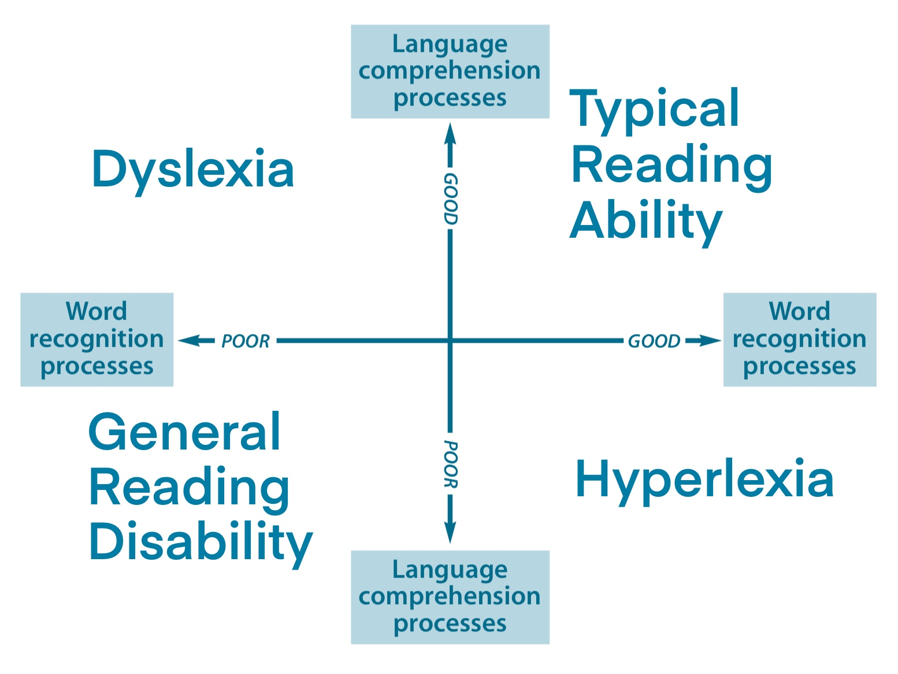
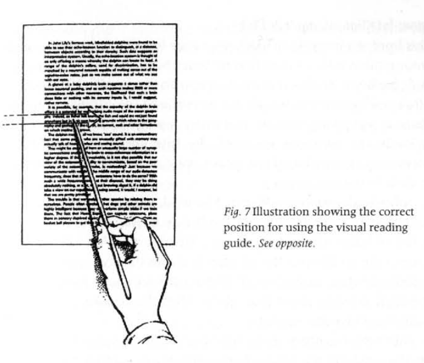
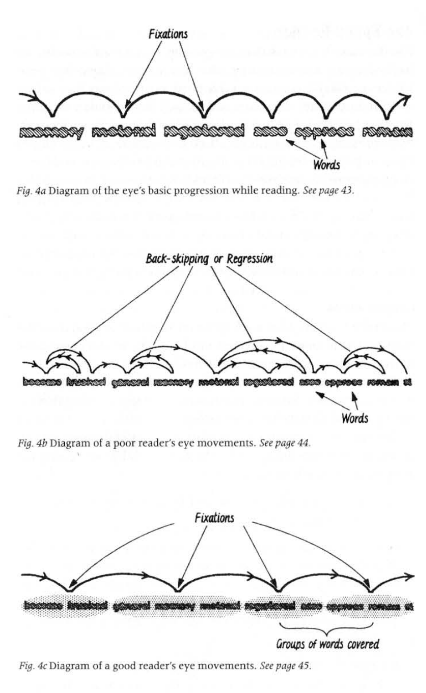

Effective reading is one of the fastest ways to learn and increase your information input, enabling you to understand and solve more and more complex problems.

After giving an overview of the science of reading, I will describe a relatively new type of reading, Reading While Listening, and compare tools that you can use to augment your reading.

# The Science of Reading
## Models

There are two main scientific models of reading. The simple one is the [Simple view of Reading (SVoR)](https://en.wikipedia.org/wiki/Simple_view_of_reading), and was proposed by researchers Gough and Tunmer in 1986. It defines reading comprehension as the product of decoding and linguistic comprehension. It is useful to categorize the most frequent reading disabilities:

A more refined model, Scarborough's Reading Rope was published in 2001 and breaks down the ability to read into Language-comprehension and Word-recognition. 

[The active view of reading (AVR)](https://doi.org/10.1002%2Frrq.411) model from May 7, 2021, recognizes that some reading abilities like vocabulary comprehension contribute to recognition and comprehension. It also separates active self-regulation, which determines the reading quality based on factors such as working memory, attentional control, and the skill of planning.  

# Reading While Listening (RWL)

In a meta-study with the title [Audio-visual synchronization in reading while listening to texts: Effects on visual behavior and verbal learning.](https://www.sciencedirect.com/science/article/pii/S0885230816300596) from 2017, published in Computer Speech & Language, the authors report positive findings: 

> The first reports of the effect of RWL were very promising, especially for poor readers. In these non-experimental studies, RWL improved comprehension, word recognition, word meaning acquisition (Carbo, 1978), reading fluency (van der Leij, 1981), motivation to read (Carbo, 197 8; Chomsky, 1976; Gamby, 1983), and the "awareness of the end product of learning to read" (van der Leij, 1981).  

The main reasons, the authors in this paper also touch on, for this effect seem to be improved comprehension and reading speed:

## Improved comprehension

The first factor involved in improved comprehension is the reduced cognitive load. [Automaticity theory](https://www.tandfonline.com/doi/abs/10.1080/1057356970130202) defines the reading process, listed as part of the models above, simultaneous (i.e., as multi-threaded), which all take up cognitive resources and are limited by the reader's working memory. This theory suggests that making one or two components automatic may allow readers to pay more attention to other tasks in the reading process.

Similarly, in a [different paper](http://slureading.pbworks.com/f/reading+aloud.pdf), the author conjectures that RWL-readers
> benefited from a lighter cognitive load. With additional cognitive resources available for comprehension, these students achieved higher quiz scores. In other words, their improved reading fluency facilitated their reading comprehension.

The second, closely related factor is the multimodal information intake. For a closer look at the neuroscience of reading, I recommend [this presentation by Stanislas Dehaene](https://youtu.be/25GI3-kiLdo?t=498), author of Reading in the Brain. Herein he also shows that information intake of visual reading or listening uses different paths but is both processed in the same brain region responsible for higher-level understanding.

Thus we can conjecture that the gain in comprehension is achieved through  _multimodal_-input of the same information.  
> Research in fundamental cognitive psychology has shown that such an audio-visual redundancy favors further recall of words (e.g., Bird & Williams, 2002; [Lewandowski & Kobus, 1993](https://www.tandfonline.com/doi/abs/10.1207/s15327043hup0603_3)) compared to unimodal (i.e., either oral or visual) presentations. 

## Improved reading speed

The increased reading speed is achieved by reducing regressive saccades (eye movement). These unintended reflexive eye movements are driven by our brain trying to achieve 100% prediction accuracy and understanding. In some cases, this is useful to "re-encode" the content or further process it, but often it is redundant since the meaning of a viewed word will often come apparent by reading the following text and context. In his book on [Speedreading, Tony Buzan](https://www.amazon.com/Speed-Reading-Third-Tony-Buzan/dp/0452266041) lists other effects such as unconscious back-skipping, visual wanderings, and conscious regressions.

Here Buzan also recommended using a metronome, reading each line at the metronome rate, guiding the eyes using a stick, and gradually increasing the metronome rate.

The RWL software has a similar effect: reducing regressive saccades by guiding your eyes to continue reading. However, the currently available software, which I list below, still has a lot of improvement potential. 

After going back to the speed-reading literature, I also noticed potential improvements in the current-position/word highlighting of the RWL software. One improvement would be to help the user reduce the number of fixations by chunking words together based on the reader's ability.

The only downside of using these RWL applications I experienced was that they could reduce your ability to read fast when you don't use them. We might observe a similar effect when trying to study without nootropics after excessive use of them.

# Improving your Reading process

Now that I explained the science of reading and its micro-augmentation let's look at a few higher-level tidbits that will help optimize your entire reading process. This is not a comprehensive list and more so a list of pointers to explore.

**Characteristics of a skilled reader**: In her book [Effective Note Taking](https://www.amazon.com/Effective-Notetaking-Study-Skills-McPherson/dp/1927166527), Fiona McPherson describes that 
1) skilled readers read the topic introducing and difficult to relate to main topic sentences slower and that 
2) they recall more superordinate than subordinate items (i.e., they think about how a given argument or concept fits into the greater whole). 

**Preparation and selection**: This [article on how to choose what to read](https://vasilishynkarenka.com/how-to-choose-what-to-read/) describes that we should be asking ourselves "Is this a book in 260,000?". [Naval Ravikant](https://alexandbooks.com/archive/16-reading-tips-from-naval-ravikant) and [others](http://www.collaborativefund.com/blog/how-to-read-lots-of-inputs-and-a-strong-filter/) have also talked about having a strong filter and disregarding books fast after one loses interest.

**Training micro-skills**: One lesson we can draw from the above-discussed models is that reading is a complex skill constituted of many parts that one can train individually. You can, for example, improve the bridging process skill of vocabulary knowledge when you add new words that you come across and learn about to your spaced repetition system.

**Reading research papers in unfamiliar field**: Michael Nielsen describes how to [improve the exploratory reading and internalization process](http://augmentingcognition.com/).

**Decide on reading type and depth**: This article [Reading books vs. engaging with them](https://www.cold-takes.com/reading-books-vs-engaging-with-them/) might be helpful to think about your time investments after you decide on your material. The classical [book on reading by Mortimer J. Adler](https://www.amazon.com/How-Read-Book-Classic-Intelligent/dp/0671212095) also touches on the four levels of reading (i.e., Elementary Reading, Analytical, and Syntopical). For a shorter overview, I recommend the essay [How to Read a Book](https://pne.people.si.umich.edu/PDF/howtoread.pdf) by Paul Edwards, academic historian and CISAC fellow at Stanford. The German philosopher [Arthur Schopenhauer also wrote](https://fs.blog/wp-content/uploads/2016/11/Arthur-Schopenhauer.pdf) about the tradeoff between reading and thinking for ourselves. Schopenhauer describes reading as letting others think for you.

**Leveraging Curiosity**: A friend of mine [Adithya Balaji](https://www.adithyabalaji.com/) (he also wrote a [nice article on audio reading](https://www.adithyabalaji.com/productivity/2021/11/20/Apple-Spoken-Content.html)) once told me about his curiosity driving reading strategy rule, which is "read now or disregard". My current system is that I separate reading from searching reading material. I like to batch process them because they use different cognitive processes (information search vs. consumption). I also like Adithya's policy, though, and it seems there is a tradeoff between the use of curiosity and efficiency. If you have a different approach or advice on this, I'd be curious to hear it! (I plan to dive into the topic of curiosity and write about it here in the future).

# Best Reading while listening Application
### Amazon Wispersync 

Wispersync is the best RWL option for books. It's handy if you mainly listen to the audiobook but want to make highlights. You'll always be at the correct position. My current alternative workflow is that I have the corresponding book in iBooks and search the section to do highlights which is slower. There is not much information about it, but I found this [article explaining the market of Wispersync](https://goodbetterbest.substack.com/p/amazons-whispersync-for-voice). 

### Natural Reader (best for PDFs)
The natural reader is the best option for PDFs and has a fast loading speed. It also auto has some logic to disregard stuff in parentheses, i.e., academic references like (author_x at al. year_y), which improves the listening experience.

The three cons are that there is no mobile app, bookmarking feature, and you can click on the text to navigate what to read, which interferes with text highlighting.
### Speechify
Speechify has a web and mobile app. It also has some very high-fidelity voices (I think from Google WaveNet).
### Matter
Matter is the best reading app that supports RWL I found and has some good social features to follow certain writers.
<!-- ### RemNote PDF annotation
As a quick plug for the product I'm building, RemNote has the best PDF annotation, as you can effortlessly reference specific quotes in your notes and convert them into flashcards. -->
# Conclusion
Choose what you read wisely, use your curiosity as a driver,  and augment your reading with technology.

If you're interested in improving reading and learning technology join us to build the next version of the RemNote PDF-Annotation tool and much more. If you have been thinking about too or have suggestions, I'd love to hear from you. Also let's [connect on GoodReads](https://goodreads.com/moritzw). 